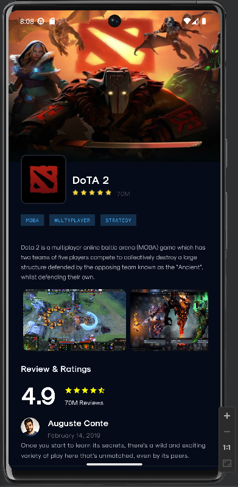
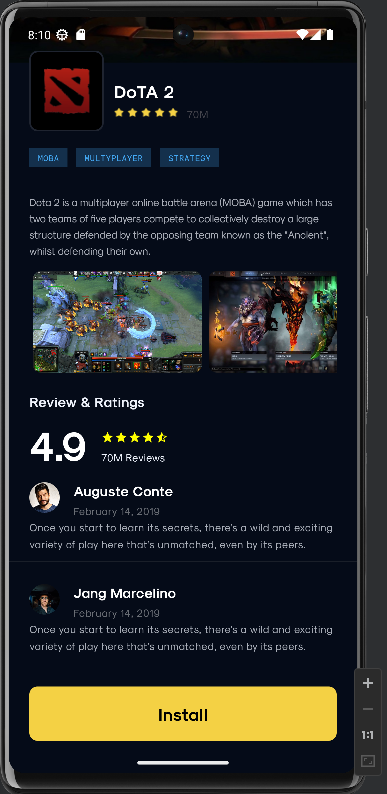
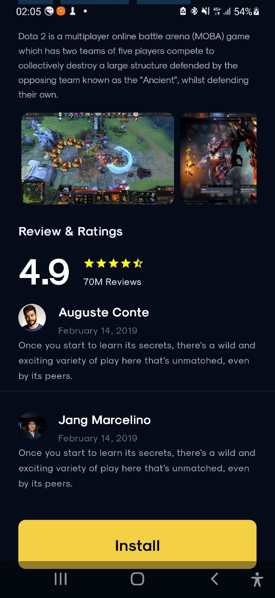
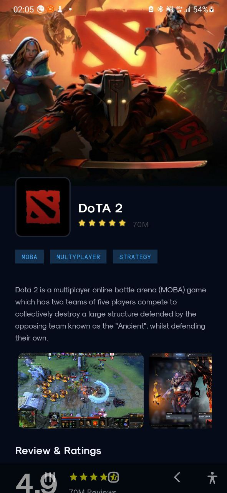

# AndroidTestHometask1
## Описание лабораторной работы
Данная работа представляет собой сверстанный экран по компьютерной игре Dota 2 с использованием Kotlin. Код был написан в Android Studio и целью лабораторной работы было разобраться в технологии Jetpack Compouse.
## Результаты

